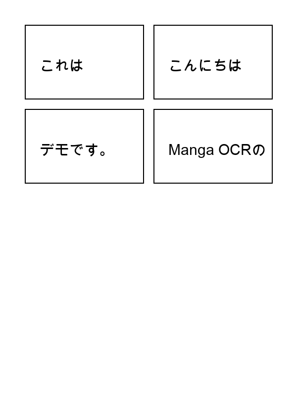
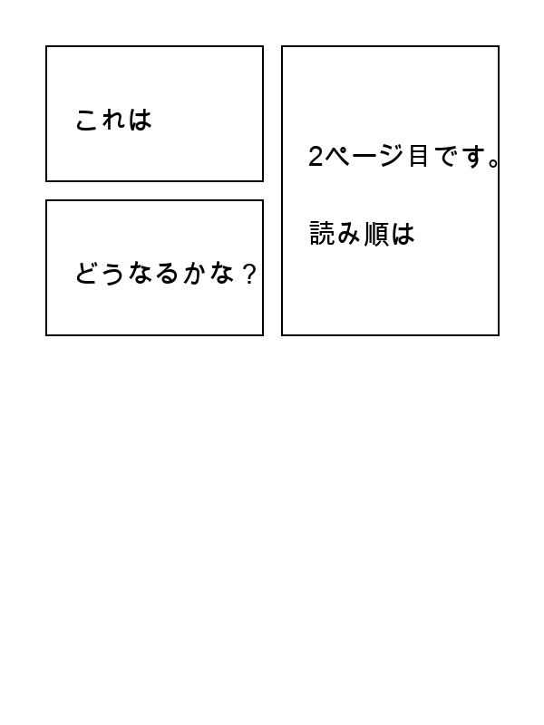
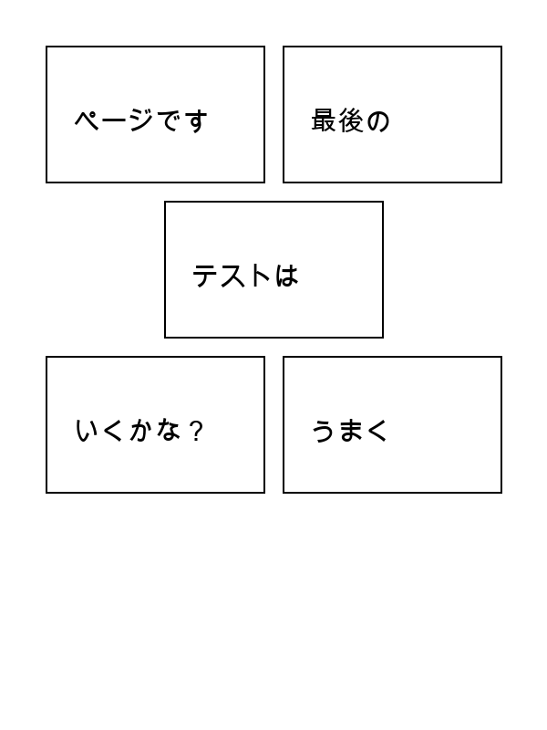

# Manga OCR CLI Tool

Zipファイルで圧縮された漫画画像を一括で読み込み、OCRを実行してテキストデータを出力するPython CLIツール。

Apple Silicon (M1/M2/M3/M4) のMPS (Metal Performance Shaders) を活用し、ローカル環境で高速に推論を行います。

## 機能

- ✅ Zipファイルから漫画画像を一括処理
- ✅ 複雑なコマ割りや自由なセリフ配置に対応したテキスト領域（吹き出し）の自動検出
- ✅ 漫画の読み順に基づいたテキスト抽出 (ただし、意図しない順番になるケースもあります)
- ✅ ページごとのセリフ読み取り精度が高いOCR処理
- ✅ JSON形式とテキスト形式での出力
- ✅ Apple Silicon (MPS) による高速OCR処理

## 要件

- Python 3.10+
- **推奨環境**:
  - Apple Silicon Mac (M1/M2/M3/M4) - MPS対応（最速）
  - Windows/Linux with NVIDIA GPU - CUDA対応（高速）
  - その他の環境でもCPUで動作します（やや遅い）
- PyTorch（GPU対応版を推奨）

## インストール

このツールは、PyPIで公開されている `manga-ocr` パッケージと、テキスト検出用の `comic-text-detector` を組み合わせたラッパーツールです。
以下の手順でセットアップを行ってください。

### 1. リポジトリのクローン

まず、このリポジトリと、submoduleとして含まれている `comic-text-detector` を一緒にクローンします。

```bash
# submoduleも含めてクローン（推奨）
git clone --recursive https://github.com/kazuki-ookura/manga-ocr.git
cd manga-ocr

# もし --recursive をつけずにクローンしてしまった場合
# git submodule update --init --recursive
```

### 2. モデルファイルの配置

次に、テキスト検出モデルをダウンロードし、正しい位置に配置します。

以下のリンクからモデルファイル（`comictextdetector.pt`）をダウンロードしてください。

- [manga-image-translator 最新リリースページ](https://github.com/zyddnys/manga-image-translator/releases/latest)
- [Google Drive](https://drive.google.com/drive/folders/1cTsXP5NYTCjhPVxwScdhxqJleHuIOyXG?usp=sharing)

ダウンロードしたファイルを `vendor/comic-text-detector/data/` ディレクトリに配置します。

```bash
# dataディレクトリが存在しない場合は作成
mkdir -p vendor/comic-text-detector/data

# ダウンロードしたファイルを配置（例: ダウンロードフォルダからの移動）
mv ~/Downloads/comictextdetector.pt vendor/comic-text-detector/data/
```

**重要**: このモデルファイル（約76MB）はテキスト検出に必須です。配置しないとテキスト領域の検出が行われません。

### 3. 仮想環境の作成と依存関係のインストール

Pythonの仮想環境を作成し、必要なパッケージをインストールします。

```bash
# 仮想環境を作成（推奨）
python3 -m venv venv
source venv/bin/activate

# 依存関係をインストール
pip install -r requirements.txt
```

**注意**: このプロジェクトは `pip install -e .` でのインストールを想定していません。必ず `pip install -r requirements.txt` を使用してください。


## 使用方法

### 基本的な実行方法

セットアップ完了後、以下のコマンドでツールを実行します。`python3 -m src.cli` の後に、処理したいZipファイルのパスを指定してください。

```bash
# 基本的な使用
python3 -m src.cli comic.zip
```

### コマンドオプション

- **JSON形式のみ出力:**
  ```bash
  python3 -m src.cli comic.zip --output-format json
  ```
- **出力ディレクトリを指定:**
  ```bash
  python3 -m src.cli comic.zip -o ./results
  ```
- **詳細ログ付きで実行:**
  ```bash
  python3 -m src.cli comic.zip --verbose
  ```
- **CPUを強制使用:**
  ```bash
  python3 -m src.cli comic.zip --device cpu
  ```
- **エラー時に処理を中断:**
  ```bash
  python3 -m src.cli comic.zip --no-skip-errors
  ```

### 出力ファイル

処理が完了すると、以下のファイルが生成されます:
- `{zip_filename}_output.json`: JSON形式の構造化データ
- `{zip_filename}_output.txt`: 人間が読みやすいテキスト形式

### 使用例

```bash
# 実際の使用例
python3 -m src.cli '漫画タイトル.zip' --verbose

# 出力例:
# 画像ファイルを 218 個見つけました
# 処理を開始します（デバイス: mps）...
# 処理完了: 218 ページを処理しました
# 出力ファイル:
#   - 漫画タイトル_output.json
#   - 漫画タイトル_output.txt
```


## 注意事項

- **comic-text-detector**: テキスト検出機能を使用するために必須です。インストール手順の「2. comic-text-detectorのセットアップ」を参照してください。
- **モデルファイル**: `comic-text-detector` のモデルファイル（`comictextdetector.pt`）が必須です。インストール手順の「4. モデルファイルの配置」を参照してください。
- **初回実行**: 初回実行時、`manga-ocr` がモデルをダウンロードするため時間がかかります。
- **処理時間**: 画像数やサイズによって処理時間が異なります。大量の画像がある場合は時間がかかります。
- **MPSサポート**: OCR処理はMPSを使用して高速に実行されます。テキスト検出はCPUで実行されます（詳細は `docs/PERFORMANCE.md` を参照）。
- **読み取り可能な文字**: 効果音など、通常の漫画セリフフォントではない装飾的な文字は、OCRエンジンの特性上、正確に読み取ることができません。

## トラブルシューティング

問題が発生した場合は、`docs/TROUBLESHOOTING.md` を参照してください。

## ドキュメント

- **トラブルシューティング**: `docs/TROUBLESHOOTING.md` - よくある問題と解決方法
- **パフォーマンス**: `docs/PERFORMANCE.md` - デバイス使用、MPS、パフォーマンスについて
- **開発計画**: `docs/20_PLAN/roadmap.md` - 開発状況と実装計画

## ライセンス

MIT License

## デモ

ツールの基本的な動作を示すための簡単なデモです。

### 1. 入力画像

以下のような、単純なコマ割りとセリフを含む3ページの漫画画像（`page1.png`〜`page3.png`）を用意し、`demo.zip`として圧縮します。

<p align="center">
  
  
  
</p>

### 2. 実行コマンド

まず、`demo_images_png` ディレクトリ内の画像を `demo.zip` という名前で圧縮します。

```bash
zip -j demo.zip demo_images_png/page1.png demo_images_png/page2.png demo_images_png/page3.png
```

次に、生成された `demo.zip` に対して、以下のコマンドを実行します。

```bash
python3 -m src.cli demo.zip
```

### 3. 出力結果

実行後、`demo_output.txt` に以下の内容が出力されます。

```text
[page1.png]
こんにちは
これは
Manga OCRの
デモです。

[page2.png]
これは
２ページ目です、
読み順は
どうなるかな？

[page3.png]
最後の
ページです
テストは
うまく
いくかな？

```

### 4. 結果の解説

- **1ページ目と3ページ目**では、漫画の基本的な読み順（右上→左下、段ごと）が正しく認識されています。
- **2ページ目**では、縦長のコマが影響し、一部の読み順が人間の直感とは異なる結果になっています。

このように、本ツールは多くの基本的なレイアウトでセリフの順序を正しく認識できますが、複雑なコマ割りでは意図しない順序になる場合があることを示しています。
